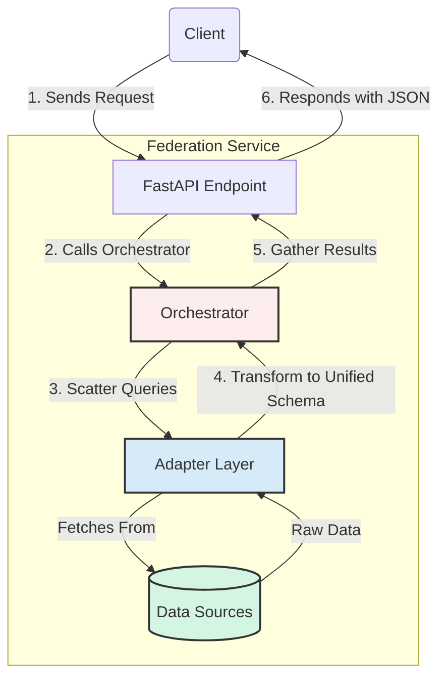

# Simplified Architecture Diagram

This diagram provides a high-level conceptual overview of the federated data architecture, focusing on the primary flow of a request.

### Explanation of the Flow

1.  **Request**: A client sends a request for company data to the public-facing FastAPI Endpoint.
2.  **Orchestration**: The endpoint delegates the work to the Orchestrator.
3.  **Scatter**: The Orchestrator sends out concurrent requests to all registered adapters in the Adapter Layer. Each adapter knows how to communicate with its specific Data Source.
4.  **Transform**: As each adapter receives raw data from its source, it transforms that data into a common, unified Pydantic model.
5.  **Gather**: The Orchestrator waits for all adapters to return their transformed, unified data and gathers the results into a single collection.
6.  **Respond**: The Orchestrator passes the collected data back to the API Endpoint, which formats the final JSON response and sends it to the client.